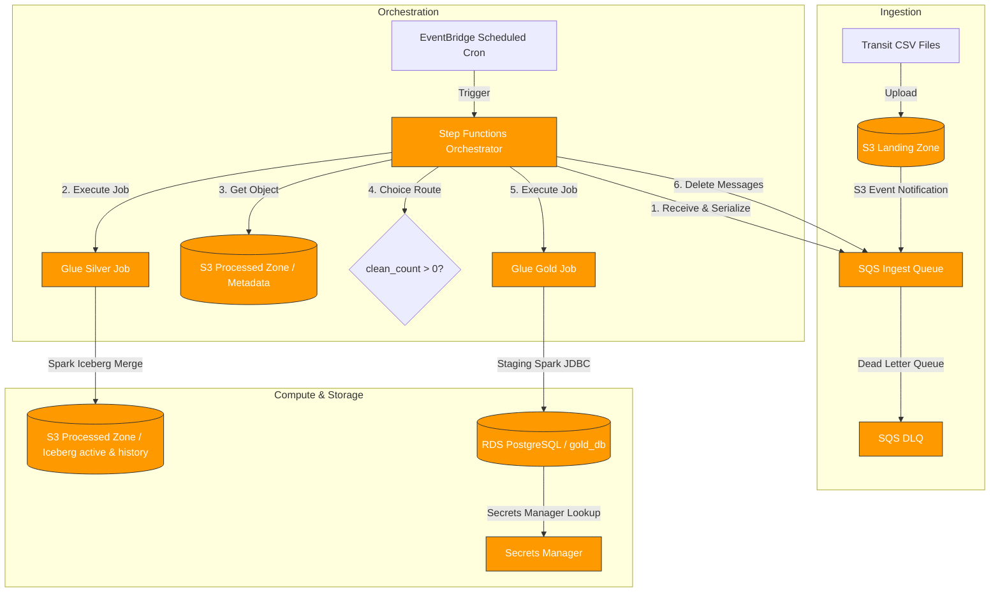

# Event Driven Data Pipeline

A production-grade, highly secure, cost-optimized, and transactional serverless data pipeline designed to ingest, clean, and aggregate city transit ridership records.

---

## 🏗️ Architecture & Data Flow

The pipeline is built on a **layered, decoupled AWS architecture** utilizing S3 datalake zones, SQS buffering, Step Functions orchestration, Glue PySpark (for Silver Iceberg storage), and transactional PostgreSQL loading (for Gold database views).



---

## 📊 Data Layer & Zones

1.  **Landing Zone (`raw`):** Stores raw incoming CSV records inside `/incoming/`. Triggers object-creation events to notify the queue.
2.  **Processed Zone (`silver`):** Hosts optimized Apache Iceberg tables under two layers:
    *   `silver_trips_active`: Tracks active/in-flight transit trips (supports updates/deletions).
    *   `silver_trips_history`: Append-only chronological log of all completed trips.
3.  **Gold Layer (`rds`):** Fully normalized PostgreSQL database views capturing business intelligence metrics:
    *   `gold_daily_ridership`: Daily trip count and passenger summaries by route and vehicle.
    *   `gold_top_routes_weekly`: Weekly ranking of transit routes based on completed trips and passenger throughput.
    *   `gold_trip_outliers`: Audit log tracking anomalous trips exceeding 3 standard deviations from average duration.
4.  **Quarantine Zone (`quarantine`):** Isolates malformed or corrupted CSV rows using the `PERMISSIVE` Spark reading mode for downstream diagnostic audits.

---

## 🔒 Security & Cost-Optimization Controls

### Security & Governance
*   **Customer Managed Keys (KMS CMK):** All S3 buckets, SQS queues, Secrets Manager blocks, and RDS storage volumes are encrypted using a dedicated Customer Managed Key (CMK) with enforced least-privilege key policies.
*   **Data Lake Access Logging:** Every S3 bucket has Server Access Logging enabled, routing access trails into a central logging bucket for audit transparency.
*   **Secret Rotation:** Database credentials are autogenerated by Terraform and stored in **AWS Secrets Manager**, preventing credentials from leaking in CloudWatch logs or job arguments.
*   **Least-Privilege IAM:** The Glue Job Role and Step Functions Execution Role are strictly scoped to the exact S3 prefix paths, SQS queues, and Secrets Manager resources they require.

### Cost Control
*   **WAP Staging Stalls:** Downstream compute steps (Glue Gold Job) are **completely bypassed** if the Silver step processes 0 clean records, avoiding redundant warehouse charges.
*   **Athena workgroup guardrails:** Athena query workgroup enforces query result encryption and has a **10 GB scan threshold limit** to prevent runaway billing queries.
*   **S3 Lifecycle Rules:** Transition rules are applied to old S3 logs and temporary storage to transition them to Glacier/Deep Archive after 30 days.

---

## 🛠️ Infrastructure Directory Layout

The Terraform code is organized in a "Terragrunt-Ready" modular structure:

```text
terraform/
├── modules/                         # Reusable resource modules
│   ├── kms/                         # Customer Managed Keys
│   ├── s3/                          # S3 buckets with server access logging
│   └── sqs/                         # SQS queues with DLQ and key policies
└── environments/
    └── dev/
        └── us-east-1/               # Regional Dev deployment
            ├── bootstrap/           # Remote state S3 bucket & DynamoDB lock table
            ├── security/            # KMS, SFN Roles, Glue Roles, IAM policies
            ├── storage/             # Data Lake S3 buckets, SQS, RDS PostgreSQL
            ├── pipeline/            # Glue Jobs, SFN State Machine, SNS topic
            └── monitoring/          # CloudWatch Alarms (DLQ count, latencies, failures)
```

---

## 🚀 Deployment Instructions

Ensure you have configured the AWS CLI with credentials.

### 1. Initialize Regional Bootstrap
Deploys the state bucket and DynamoDB locking table:
```bash
cd terraform/environments/dev/us-east-1/bootstrap/
terraform init
terraform apply
```

### 2. Layered Deploy Sequence
Run `terraform init` and `apply` in each directory in the following sequence. 

Ensure you pass the dynamic `-backend-config` parameters during `init`:

```bash
# 1. Deploy Security (KMS, Roles)
cd ../security/
terraform init -backend-config="../../backend-shared.tfvars" -backend-config="key=terraform/environments/dev/us-east-1/security/terraform.tfstate"
terraform apply

# 2. Deploy Storage (S3, SQS, RDS, Secrets Manager)
cd ../storage/
terraform init -backend-config="../../backend-shared.tfvars" -backend-config="key=terraform/environments/dev/us-east-1/storage/terraform.tfstate"
terraform apply

# 3. Deploy Pipeline (Glue, SFN, SNS)
cd ../pipeline/
terraform init -backend-config="../../backend-shared.tfvars" -backend-config="key=terraform/environments/dev/us-east-1/pipeline/terraform.tfstate"
terraform apply

# 4. Deploy Monitoring (CloudWatch Alarms)
cd ../monitoring/
terraform init -backend-config="../../backend-shared.tfvars" -backend-config="key=terraform/environments/dev/us-east-1/monitoring/terraform.tfstate"
terraform apply
```

---

## 📈 Verification Queries (PostgreSQL)

You can retrieve the connection address and password from your `storage` layer outputs:
```bash
cd terraform/environments/dev/us-east-1/storage/
psql "postgresql://dbadmin:$(terraform output -raw rds_password)@$(terraform output -raw rds_address):5432/gold_db"
```

### View Daily Aggregates
```sql
SELECT trip_date, route_id, vehicle_type, total_trips, peak_hour 
FROM gold_daily_ridership 
ORDER BY trip_date DESC, total_trips DESC LIMIT 10;
```

### View Weekly Top Routes
```sql
SELECT calculation_date, route_rank, route_id, total_trips, avg_trip_duration_minutes 
FROM gold_top_routes_weekly 
ORDER BY calculation_date DESC, route_rank ASC LIMIT 10;
```

### View Anomaly Audit Log
```sql
SELECT trip_id, route_id, start_time, duration_minutes, z_score, outlier_reason 
FROM gold_trip_outliers 
ORDER BY z_score DESC LIMIT 10;
```
