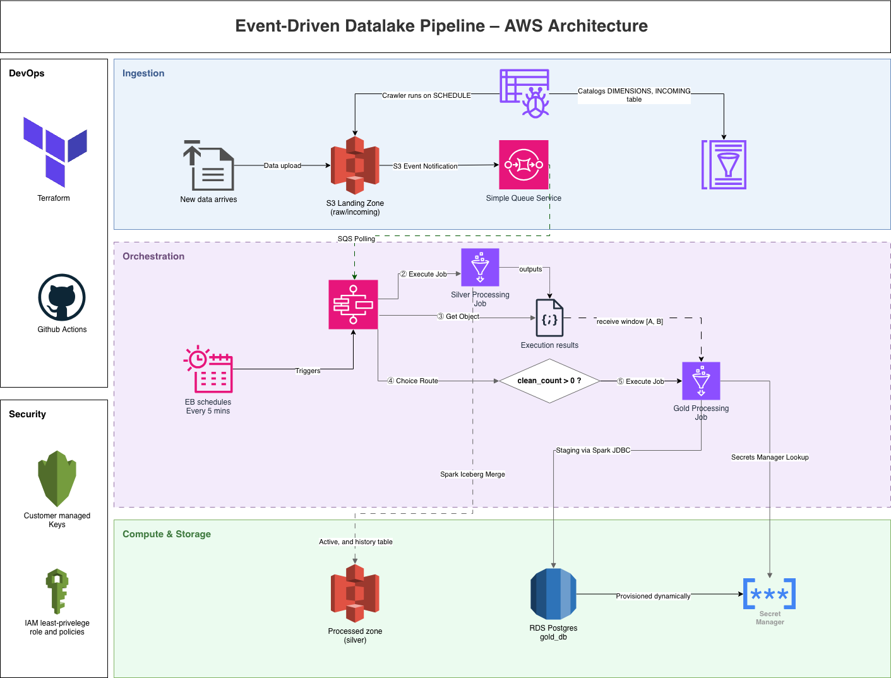

# Architectural Deep-Dive & Design Decisions

This document provides a detailed technical explanation of the engineering decisions, data patterns, and security guardrails implemented in the Event-Driven Data Pipeline.

---

## 🏗️ 1. End-to-End System Architecture



---

## 📥 2. Ingestion Throttling & SQS Buffer Pattern

### The Ingestion Bottleneck
In large-scale municipal operations, hundreds of transit vehicles upload daily files at similar times (e.g., end-of-shift dumps). Directly triggering a serverless compute job (like AWS Glue or Lambda) for each upload creates massive resource spikes, risking API throttling, database connection pool exhaustion, and runaway costs.

### The Buffer Solution
*   **SQS Decoupling:** S3 bucket notifications do not trigger compute directly. Instead, they write lightweight event records (S3 bucket name and key path) into an Amazon SQS queue.
*   **Throttling & Batching:** Step Functions polls SQS on a scheduled cron. It retrieves files in structured batches (e.g. up to 10 or 100 messages at a time) and processes them in a single, controlled Glue Spark execution.
*   **Fault Isolation (DLQ):** If a message fails processing three times (`maxReceiveCount = 3`), it is redirected to a Dead Letter Queue (DLQ) for operator analysis, preventing poison pills from blocking the ingestion stream.
*   **Confused Deputy Protection:** The SQS queue policy strictly permits `sqs:SendMessage` from our specific landing S3 bucket ARN, preventing unauthorized accounts from pushing messages to our queue.

---

## 📑 3. Silver Layer: Split Table Design & Idempotency

### Active (`silver_trips_active`) vs. History (`silver_trips_history`)
To support both operational fleet tracking and historical trend analysis, we decouple our Silver storage layer into two distinct S3 Apache Iceberg tables:

| Feature | Active Table (`silver_trips_active`) | History Table (`silver_trips_history`) |
| :--- | :--- | :--- |
| **Purpose** | Captures the **current state** of all trips. | Captures the **full timeline** of all events. |
| **Data Pattern** | Updatable / Mutable. | Append-Only / Immutable. |
| **Operations** | `MERGE INTO` updates in-progress rows to completed. | `INSERT INTO` appends every row in the batch. |
| **Use Cases** | Real-time dashboards, current delays, live vehicle statuses. | Historical reports, seasonality analysis, ML training. |

### Enforcing Idempotency in Spark
To ensure that re-running the same batch of raw files does not result in duplicate records, we implement a two-tiered deduplication strategy:
1.  **Incoming Path Deduplication:** In Python, we extract SQS message payloads and run a set-filter (`list(set(s3_paths))`) to discard duplicate object notification paths before passing them to Spark.
2.  **Micro-batch Deduplication:** Within the PySpark execution, we apply a window partition function:
    ```python
    dedup_window = Window.partitionBy("trip_id").orderBy(
        when(col("status") == "completed", 1).otherwise(2).asc(),
        col("end_time").desc_nulls_last()
    )
    merge_source_df = raw_df.withColumn("rn", row_number().over(dedup_window)) \
                            .filter(col("rn") == 1) \
                            .drop("rn")
    ```
    This windowing ensures that if a single micro-batch contains multiple updates for the same `trip_id` (e.g., an in-progress update and a completion log in the same batch), Spark deduplicates the record prior to merging. This prevents **merge cardinality violations** (when multiple source rows match a single target row).

---

## 🔗 4. Transaction Isolation: Iceberg WAP (Write-Audit-Publish)

### The Dirty Data Problem
If a Spark job fails halfway through writing files to a traditional data lake, the target folder is left in a corrupted state containing partially written Parquet files. Downstream business intelligence queries or secondary compute steps (like our Gold job) that read from the table during this time will return inconsistent data.

### The WAP Solution & Cross-System Transaction Safety
We utilize Apache Iceberg’s native **Write-Audit-Publish (WAP)** branching pattern in a unique way to establish distributed transaction safety across S3 and RDS PostgreSQL:

1.  **Isolate (Write):** At the start of execution, Step Functions passes the unique execution ID WAP branch parameter. Spark performs all Silver merges and history appends directly onto this isolated branch (e.g. `wap_20260701_211111`). The `main` branch of our data lake remains completely clean and untouched.
2.  **Audit & Process (Gold Load):** Rather than merging immediately, the pipeline **defers the WAP merge**. The subsequent Gold job reads its aggregation source **directly from this temporary WAP branch**, computes metrics, and loads them into RDS PostgreSQL using JVM JDBC database transactions.
3.  **Publish (RDS Commit Guard):** Step Functions executes the Iceberg metadata fast-forward merge (promoting the WAP branch back to `main`) **only after the RDS Gold job succeeds and commits its database write**.
4.  **Distributed Rollback Safety:** If the Gold job fails to load RDS (due to DB locks, network timeout, or connection limits):
    *   The state machine terminates, and the SQS messages are **not** deleted from the queue.
    *   The Iceberg table's `main` branch is **never** updated with the dirty batch, leaving S3 in a clean state.
    *   This effectively links S3 and RDS under a unified transactional boundary—if either compute step fails, the entire run is rolled back.

---

## 📈 5. Gold Layer: Incremental Recalculations vs. Full Refresh

### The Scaling Problem
Recomputing the entire database catalog on every run does not scale. If a pipeline runs every hour and processes 1,000 rows, performing a full database refresh of millions of historical rows in RDS PostgreSQL consumes massive DB CPU, locks tables, and creates unnecessary I/O overhead.

### The Incremental Solution
We implement a **date-bounded incremental recalculation** pattern:
1.  **Metadata Date Extraction:** During the Silver Glue job, Spark calculates the minimum and maximum dates of the successfully processed records:
    ```python
    observed_metrics = observed_df.observe(
        "run_metrics",
        min(col("trip_date")).alias("start_date"),
        max(col("trip_date")).alias("end_date")
    )
    ```
2.  **Date Propagation:** These date boundaries are written to an S3 JSON metadata file. Step Functions reads the JSON file, parses the dates, and passes them as arguments (`--start_date` and `--end_date`) to the Gold Job.
3.  **Date-Bounded Spark Query:** The Gold Job only queries the Silver Iceberg table for records falling within the processed date range:
    `WHERE trip_date BETWEEN start_date AND end_date`
    This ensures Spark only scans and aggregates the specific partitions affected by the current run.
4.  **Transactional Staging-Upsert in PostgreSQL:**
    *   Spark writes the new aggregated records to staging tables in PostgreSQL (e.g., `stage_gold_daily_ridership`).
    *   Using Spark's JVM JDBC driver, we disable auto-commit and initialize a transaction block:
        ```sql
        -- Delete old aggregates only for the affected dates
        DELETE FROM gold_daily_ridership WHERE trip_date BETWEEN :start_date AND :end_date;
        -- Insert the fresh staging records
        INSERT INTO gold_daily_ridership SELECT * FROM stage_gold_daily_ridership;
        -- Drop staging table
        DROP TABLE stage_gold_daily_ridership;
        -- Commit
        COMMIT;
        ```
    *   This guarantees that if the network drops or a write fails halfway, the entire transaction is rolled back, preserving database consistency while keeping the processing time constant regardless of overall table size.
