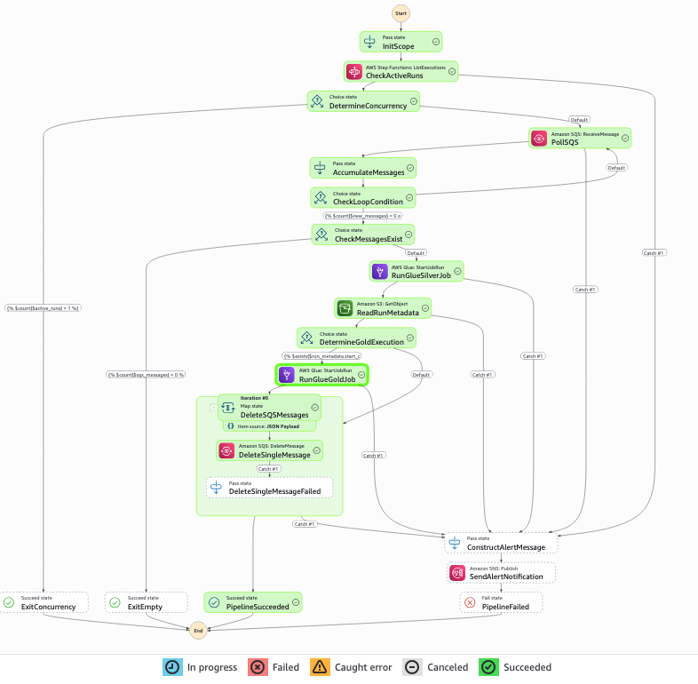
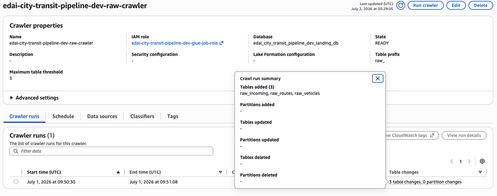
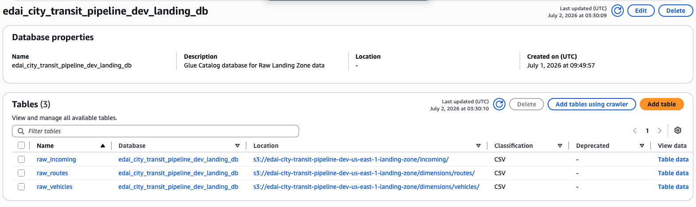
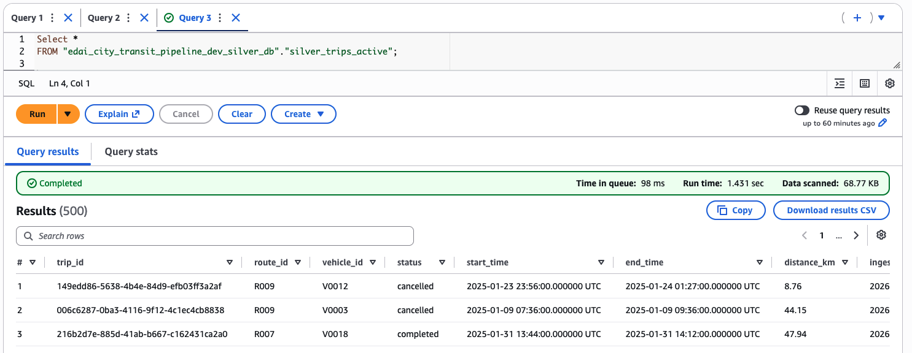
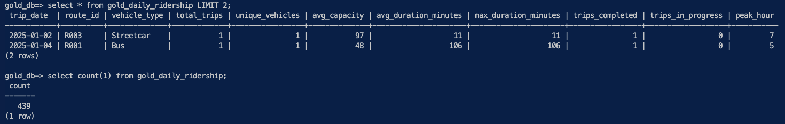
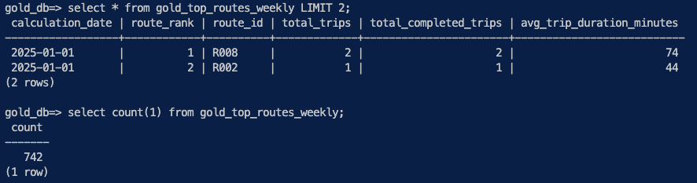
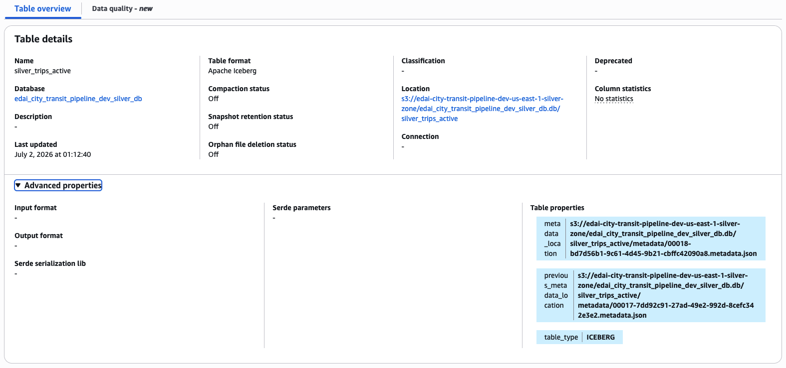
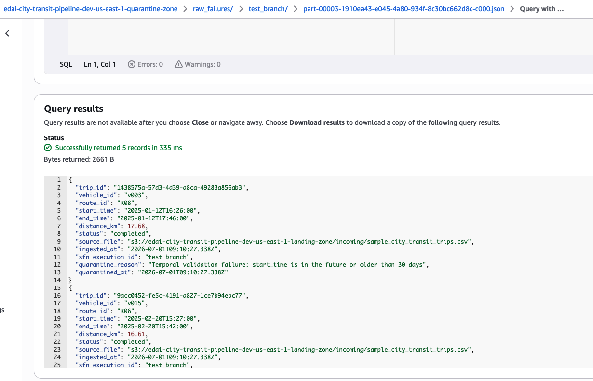

# Pipeline Verification & Verification Screenshots

This document serves as a visual proof-of-work, demonstrating the successful deployment, execution, and verification of the event-driven data pipeline.

---

## 🚀 1. Step Functions Orchestration Runs

Demonstrates the orchestrator polling SQS, executing the Silver Glue Job, evaluating run metrics metadata, dynamically routing through the choice branch, triggering the Gold RDS load, and cleaning the ingestion queue.

### State Machine Execution History

*Filename:* `docs/images/step_functions_execution.png`
*Highlight:* Successful execution sequence showing all states completed in green.

---

## 📂 2. AWS Glue Crawlers & Data Catalog Tables

Shows the cataloged dimension metadata tables and raw schema crawls inside the Glue Console.

### Glue Crawlers Console

*Filename:* `docs/images/glue_crawlers.png`
*Highlight:* Successful crawler status runs registering the schema.

### Glue Data Catalog Tables

*Filename:* `docs/images/glue_catalog_tables.png`
*Highlight:* The table listings for dimensions (`dim_routes`, `dim_vehicles`) and Silver schemas.

---

## 🔍 3. Athena Analytical Query Runs (Silver Lake)

Demonstrates executing validation SQL queries (partition checks, schema configurations) against the Apache Iceberg tables inside the S3 processed zone.

### Athena Query Editor

*Filename:* `docs/images/athena_query_runs.png`
*Highlight:* Athena query results showing active transit rows parsed from the S3 warehouse.

---

## 📊 4. RDS PostgreSQL verification (Gold Layer)

Demonstrates the final metrics loaded into the three Gold SQL database views, verifying the staging-upsert database transaction.

### Daily Ridership Metrics (`gold_daily_ridership`)

*Filename:* `docs/images/pgsql_daily_ridership.png`
*Highlight:* Results showing trip date, route ID, and passenger throughput aggregates.

### Weekly Top Routes (`gold_top_routes_weekly`)

*Filename:* `docs/images/pgsql_top_routes_weekly.png`
*Highlight:* Results showing ranked routes sorted by highest trip volume.

### Trip Duration Outliers (`gold_trip_outliers`)

*Filename:* `docs/images/pgsql_trip_outliers.png`
*Highlight:* Diagnostic log showing trip IDs, duration, z-score metrics, and anomaly reasons.

---

## 🗃️ 5. S3 Data Lake Buckets (Quarantine & Processed)

Shows S3 listings of processing directories, Iceberg metadata files, and isolated quarantine records.

### S3 Silver Processing metadata

*Filename:* `docs/images/s3_iceberg_metadata.png`
*Highlight:* Metadata JSON/AVRO files generated by Iceberg transactions.

### S3 Raw Ingest Quarantine

*Filename:* `docs/images/s3_quarantine_objects.png`
*Highlight:* Isolated corrupt CSV files stored inside the quarantine zone directory.

